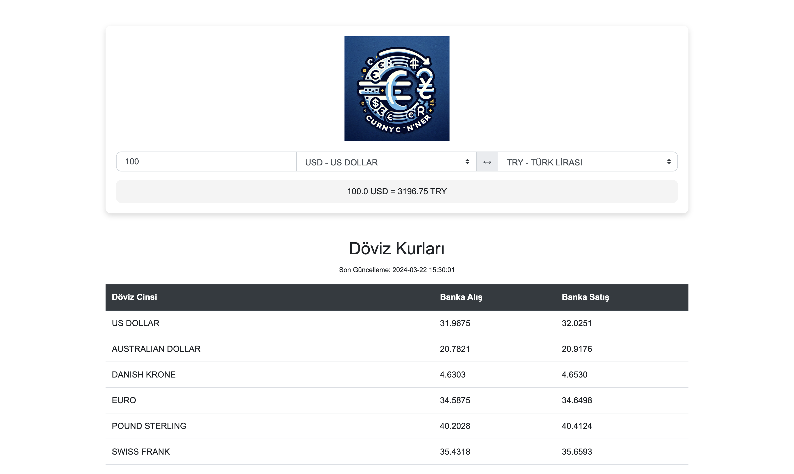

## currency-converter-v2

This is a currency converter that converts one currency to another. It is built with Python and Flask. The exchange rates are gotten from the [TCMB](https://www.tcmb.gov.tr/kurlar/today.xml) website.

## How to use

1. Clone the repository
2. Install the dependencies with `pip install -r requirements.txt`
3. Run the app with `python app.py`

